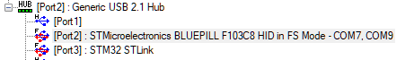

# SerialEcho
Arduino **composite** CDC device *trading terminal message in* `loop()`

Unable to get a [composite CDC + MIDI USB device Arduino 2 sketch](https://github.com/blekenbleu/MIDIecho) working  
    on an STM32 Black Pill, using
	[USBLibrary for stm32](https://github.com/Levi--G/USBLibrarySTM32);  
 &emsp; instead trying composite CDC + CDC...
- `#define TRYTWO 0` trades messages between Arduino UI Serial Monitor attached to CDC COM port  
    and PuTTY attached to a USB-to-TTY dongle COM port
- `#define TRYTWO 1` uses that USB-to-TTY dongle COM port only for a few diagnostics during `setup()`  
  while attempting to create `USBCDC Serial0` and `USBCDC Serial3`...
	- which hangs, waiting for `USB_Running()` to be true  
    - For `#define TRYTWO 1`, [USB Device Tree Viewer](https://www.uwe-sieber.de/usbtreeview_e.html)
 	shows NO device at Black Pill's USB hub port

### *17 Sep 2025* `ARDUINO_BLUEPILL_F103C8` works, but not `ARDUINO_BLACKPILL_F411CE`  

 &emsp;   
- [enumeration](BluePill.txt)  

STM32F411 USB_OTG_FS has only 3 endpoints instead of 7 on F103C8.  
